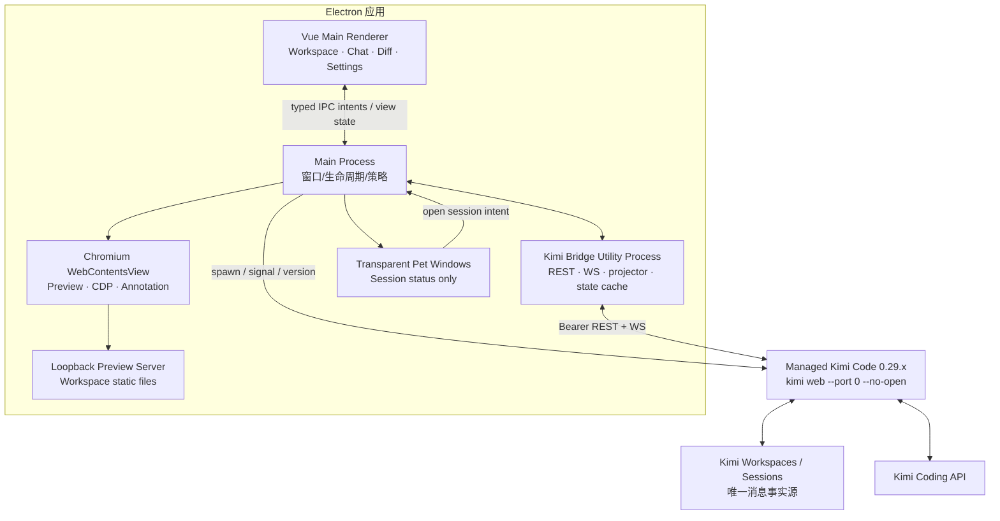

# 技术架构

## 1. 架构摘要

推荐采用 **Electron + Vue 3 + TypeScript**。Electron 负责多窗口、透明桌宠、进程管理、Chromium 开发浏览器和调试协议；Vue 延续 Kimi 官方 Web 的前端生态。Kimi Code 作为独立托管 sidecar 运行，通过官方 REST/WebSocket 提供全部 Agent 能力。

新增开发浏览器后，Electron 比 Tauri 更合适：Chromium `WebContentsView`、Debugger/CDP、页面截图、隔离 session partition 和脚本执行接口可以形成完整浏览器闭环。Tauri 仍是体积更小的候选，但 macOS WKWebView 下构建一致的 Console/Network/注释层需要更多平台特化。

## 2. 高层架构



## 3. 进程职责

### Electron Main Process

- 启动、探测、升级和关闭托管 Kimi 运行时。
- 创建主窗口、浏览器 `WebContentsView`、宠物窗口和菜单栏入口。
- 持有 IPC allowlist、导航/下载/权限策略和窗口状态。
- 接收 Bridge 的去敏状态，分发到主 UI 和桌宠。
- 管理本地静态预览 Server 和浏览器 session partition。
- 不渲染对话，不执行 Markdown，不保存 Kimi Transcript。

### Kimi Bridge Utility Process

- 持有 Kimi Server origin 和 bearer token；renderer 永远拿不到 token。
- 封装 REST、WS handshake、subscribe、ack、reconnect、snapshot/resync。
- 复用/跟踪官方 Web 的 wire types、mappers、projector 和 reducer。
- 维护有限的内存 View State：Workspace/Session 摘要、当前打开 Session、活跃 Session 状态和 WS cursor。
- 将结构化 UI state/delta 通过 IPC 发给 Main；不把任意 Server payload直接透传给 Renderer。
- Bridge 崩溃可单独重启，不带走桌面主进程。

首个 Spike 若证明 Utility Process 增加过多复杂度，可暂时把 Bridge 放在 Main 内，但对 Renderer 的 IPC 和 token 隔离边界保持不变。

### Vue Main Renderer

- 使用 Pinia 或等价轻量 store 保存可重建的视图状态。
- 组件只读取 computed view props 并发出 intent，不直接访问网络和文件系统。
- 对话以 Turn 虚拟化，流式当前 Turn 与历史 Turn 分离。
- Markdown/KaTeX/Mermaid/高亮采用 worker 和内容预算。

### Browser WebContentsView

- 每个 Browser tab 是受 Main 管理的独立 `WebContents`；不使用已不推荐的 `<webview>` tag。
- 使用 Workspace 级持久 partition，例如 `persist:kad-browser:<workspaceHash>`；提供临时无痕 partition。
- 通过 `webContents.debugger` 接入 CDP `Network`、`Runtime`、`Page` 域，向自定义 Console/Network UI发送去敏事件。
- 完整 Chromium DevTools 可作为高级独立窗口，但与 CDP debugger 占用冲突时二者互斥。
- 批注脚本通过隔离 world 执行，只返回白名单字段；Guest 页面没有 Node 权限。

### Pet Windows

- 小型透明 `BrowserWindow`，frameless、always-on-top、skip-taskbar。
- 只接收 `{sessionId,title,workspace,status,badges,elapsed}` 等去敏状态。
- 不持有 Kimi token、Transcript、文件内容或浏览器 Cookie。
- 动画由原创 sprite atlas/Lottie/WebGL 之一实现；状态机与素材格式由项目自有规范定义。

## 4. Kimi 运行时管理

### 托管模式（默认）

- App Resources 内包含经过验证的 `@moonshot-ai/kimi-code` 包和兼容 Node sidecar。
- 不在用户机器上执行 `npm install -g`，避免改变 PATH 或覆盖现有 `kimi`。
- 以显式 executable/script path 启动：`kimi web --port 0 --no-open`。
- 使用用户正常的 Kimi data/share 位置，使 CLI、官方 Web 和客户端看到同一套 Session；不得把数据迁入客户端私有目录。
- 从子进程 ready 输出取得 origin/token，随后验证 `/health`、`/meta` 和 server ID。
- Main 保留进程句柄，正常退出发 SIGTERM；超时后再使用平台安全的终止方式。
- App 更新与 Kimi runtime 更新分开；runtime 只从签名 manifest 指向的固定 hash 更新。
- 分发时保留 Kimi MIT License 与 NOTICE，记录确切上游版本/commit。

### 系统模式（高级选项）

- 用户显式选择 `kimi` 路径，客户端读取 `--version` 并执行契约探测。
- 系统版本不在支持区间时不自动覆盖；提供“切回托管版本”。
- 禁止系统版本不兼容时静默退到 `stream-json` 或解析 TUI。

### 多实例

每个客户端实例默认只托管一个 Kimi Server，多个 Session 共用它。若发现另一个兼容 Server：

- 首版默认仍使用本 App 管理的实例，避免误连接未知 token/版本。
- 高级设置允许添加明确 origin/token 的 Server profile。
- 所有 Session 引用包含 `serverId`，避免不同 Server 的相同 ID 冲突。

## 5. Kimi 协议适配

### 主接入

- REST base：`/api/v1`
- WebSocket：`/api/v1/ws`
- WS bearer subprotocol：沿用官方客户端规则。
- Response envelope：检查 `{code,msg,data,request_id}`，不能只看 HTTP status。
- 初始同步：`snapshot → seed projector/reducer → subscribe({seq,epoch})`。
- 重连：从 cursor 重放；收到 `resync_required` 时重新 snapshot。

### 上游代码复用策略

不直接依赖 private npm SDK。建立独立 `packages/kimi-adapter`：

```text
packages/kimi-adapter/
  upstream.json          # repo, commit, Kimi version, copied files, license
  wire/                  # snake_case DTO
  transport/             # REST/WS environment adapter
  projector/             # raw agent events -> app events
  reducer/               # app events -> view state
  contract-tests/
```

尽量原样同步官方 Web 的 transport/projector 逻辑；产品 UI 变化不能侵入 wire 层。每次上游同步生成可审查 diff，并对未知事件计数。

### 能力和版本门禁

- `/meta.capabilities` 是运行时能力事实源。
- `/openapi.json`、`/asyncapi.json` 用于 CI schema diff，不在用户启动时动态生成整个客户端。
- 必需 capability 缺失时只禁用受影响区域并显示版本原因；核心 Prompt/Approval/Session 能力缺失则阻止连接。
- 支持区间按 minor 版本管理，patch 升级仍需冒烟测试。

### Terminal 版本兼容

Kimi `0.29.0` v2 的契约和官方 Web 客户端包含 Terminal WS 帧，但真实服务端 `WsConnectionV1` 未分发这些帧。锁定版 Runtime 因此启用 [ADR 0004](./adr/0004-kimi-v2-terminal-compatibility.md) 的 Main PTY 兼容层：cwd 只取当前 Kimi Session snapshot，输出单独编号并有界重放，重复 Attach 可恢复 Renderer reload 期间的输出，Session 切换 Detach，Runtime 停止统一回收。关闭时保留 native handle 直至真实 exit，并在宽限期后 `SIGKILL`；每 Session/全局数量分别限制为 8/24。生产打包将 `node-pty` 从 asar 解包并运行产物级 PTY smoke。它不读取或生成 Agent 事件，也不替代 Kimi Prompt/Transcript 协议。上游修复后由真实 smoke test 门禁切回官方 Terminal WS。

### Provider 变更边界

Model、Provider、Auth 与 Config 通过独立 `KimiSettingsBridge` 投影成无密钥的 typed IPC。API Key 只在新增 Provider 时短暂穿过 Renderer → Main → Kimi Server，不进入 Pinia、日志或回读响应；通用 raw config 不暴露给 Renderer。锁定版 v2 缺少 Provider 删除路由，因此按 [ADR 0005](./adr/0005-kimi-v2-provider-mutation-boundary.md) 禁止使用遮盖凭据后的 Config 全量回写或直接编辑配置文件模拟删除。

### Skills、MCP 与 Agent 投影

Skills、Tools 和 MCP 由 `KimiCapabilitiesBridge` 通过正式 REST route 投影为 typed IPC。Session Skill 激活直接调用 Kimi 的 `:activate` action；Tool 的有效状态与 MCP 重启均不在客户端另建注册表。Session snapshot 的 `subagents` 与实时 lifecycle event 进入独立 Agent projector，main Transcript projector 继续过滤非 main Agent 的 turn/delta/tool frame。详细作用域与恢复边界见 [ADR 0006](./adr/0006-kimi-skills-mcp-agent-projection.md)。

## 6. 数据所有权

| 数据                                       | 所有者/事实源           | 客户端允许保存                              |
| ------------------------------------------ | ----------------------- | ------------------------------------------- |
| Workspace / Session / Message / Transcript | Kimi Code               | 只存内存 view/cache，可随时从 snapshot 重建 |
| Prompt Queue / Approval / Question / Task  | Kimi Code               | 只存运行时映射和 cursor                     |
| Session Terminal（0.29 v2 兼容）           | Kimi Agent Desktop PTY   | 仅进程内 metadata/有界输出；Runtime 停止即回收 |
| Model / Provider / OAuth / Config          | Kimi Code               | 只存 UI 最后选择；不复制 secret             |
| Skills / Tools / MCP / Agent roster        | Kimi Code               | 只存可从 REST/snapshot/event 重建的内存投影  |
| Kimi Server bearer token                   | Kimi Code Server        | 首选仅内存，必要时 Keychain                 |
| Window/panel/pet position                  | Kimi Agent Desktop      | App support preferences                     |
| Browser cookie/local storage               | Chromium partition      | Workspace 隔离，可清理                      |
| Browser history/bookmark                   | Kimi Agent Desktop      | 可选、非 Session 数据                       |
| 未发送 Prompt/批注草稿                     | Kimi Agent Desktop      | Session ID 作用域、加版本、发送后可清理     |
| 已发送批注截图                             | Kimi Session attachment | 客户端不额外复制，临时文件按策略清理        |
| 套餐用量                                   | Kimi `/oauth/usage`     | 只保留当前值、时间和本进程阈值去重          |

不引入聊天 SQLite。若未来为了全文搜索建立索引，索引必须可删除/可重建、不能成为导出或恢复来源，并另写 ADR。

## 7. 套餐用量服务

官方 `GET /api/v1/oauth/usage` 返回：

- `kind: ok|error`
- `summary` 和 `limits[]`：`label`、`used`、`limit`、`reset_hint`
- `extra_usage`：余额、累计额度、月度已用/上限、币种

刷新调度：

```text
active app:      30s
background/pet:  60s
immediate:       prompt ended | app focused | network restored | login completed
failure:         5s → 15s → 30s → 60s，最多 60s
```

并发请求 single-flight；结果按 `provider + serverId` 缓存于内存。401 触发 Auth 状态刷新，429 尊重 Retry-After。阈值通知以“窗口 ID/label + reset 周期 + threshold”去重，周期重置后才允许再次通知。

Session usage 和 Context 使用 WS `session.usage_updated`/`agent.status.updated`，不与套餐轮询混用。

## 8. 多 Session 与桌宠状态服务

启动时：

1. `listSessions({busy:true})` 找到正在活动的 Session。
2. 建立 WS 连接，并订阅当前/活动 Session；全局 Session 事件更新摘要。
3. 对每个活动 Session 获取 snapshot 和 cursor。
4. `SessionPetStateReducer` 将 Kimi 正交事实映射为宠物状态。
5. Main 创建/回收宠物窗口，并向 Renderer 发送最小状态。

Session 完成后宠物保留一段可配置时间；应用重启时不从本地“恢复宠物”，而是重新查询真实 Session 状态。这样不会出现已经停止但仍显示 Running 的幽灵进程。

## 9. 开发浏览器与批注实现

### CDP

- Attach 后启用 `Network.enable`、`Runtime.enable`、必要的 `Page.enable`。
- Console 订阅 `Runtime.consoleAPICalled`、`Runtime.exceptionThrown`。
- Network 订阅 request/response/loading 生命周期；正文按类型、大小和用户操作按需拉取。
- Header 去敏名单至少包括 Authorization、Cookie、Set-Cookie、Proxy-Authorization 和常见 token key。
- 每个 tab 设置事件条数和总字节预算，超出后环形丢弃并显示计数。

### 批注层

Guest 隔离 world 注入 Shadow DOM overlay，负责 hover、elementFromPoint、区域选择和编号 pin。返回 DTO：

```ts
interface VisualAnnotation {
  schemaVersion: 1;
  page: {
    url: string;
    title: string;
    viewport: { width: number; height: number; dpr: number };
  };
  target: {
    kind: "element" | "region";
    selector?: string;
    xpath?: string;
    tag?: string;
    ariaLabel?: string;
    textSnippet?: string;
    rect: { x: number; y: number; width: number; height: number };
  };
  comment: string;
  capturedAt: string;
}
```

Main 使用 `capturePage(rect)` 生成截图，Renderer 只看到 object URL 和 DTO。发送时：

1. 用户预览/编辑。
2. 将截图通过 Kimi `/files` 上传，或按官方支持转成 image content。
3. 生成有界 Markdown 文本，明确把页面内容标成 untrusted observation。
4. 通过正常 `/sessions/{id}/prompts` 提交。

批注不会直接写源文件，也不会绕过 Kimi Permission。

## 10. 安全架构

### Electron

- `nodeIntegration: false`
- `contextIsolation: true`
- `sandbox: true`
- 严格 CSP，preload 只暴露具名、参数校验后的方法。
- 所有 IPC 使用 schema 校验和来源窗口校验。
- Browser guest 禁止 Node、任意 preload、自动权限和不受控新窗口。
- `will-navigate`、`setWindowOpenHandler`、`will-download`、permission request handler 全部显式处理。
- 依照 [Electron Security Checklist](https://www.electronjs.org/docs/latest/tutorial/security) 建立发布门禁。

### 本地服务

- Kimi 和预览 Server 默认只绑定 `127.0.0.1`。
- 不使用 `--dangerous-bypass-auth`。
- token 不进入 URL query、analytics、错误上报和普通日志。
- Preview Server canonical path 必须在 Workspace root 内；拒绝 traversal、NUL 和 symlink escape。
- HTML 本身是不可信内容，不能调用主进程能力。

### Prompt injection 与隐私

- 浏览页面文本、DOM 属性、Console 和 Network 均视为不可信数据。
- 发送给 Kimi 前显示明确预览，不自动附带 Cookie/Header/完整响应正文。
- 批注模式默认只采集目标元素的小段文本和用户可见截图。
- Agent Browser（未来）必须单独授权域名、动作和登录态，不能由本批注功能顺带获得。

## 11. 性能与可靠性要求

| 类别          | 目标                                                       |
| ------------- | ---------------------------------------------------------- |
| 状态延迟      | Kimi WS 事件到主 UI/宠物 p95 < 500 ms                      |
| Session 切换  | 已缓存摘要立即显示；可交互 p95 < 1.5 s                     |
| 流式渲染      | 每 frame 最多一次 UI commit，历史 Turn 不重算              |
| 长会话        | 1000 Turn 基准不崩溃，DOM 规模随可见窗口而非总历史线性增长 |
| Diff          | 默认按需；文本预算和二进制检测；并发上限 2–4               |
| Network panel | 环形缓冲，单响应和总内存上限                               |
| Bridge 恢复   | 崩溃后 5 s 内重启并从 snapshot/cursor 重建                 |
| 数据丢失      | Kimi 数据 RPO 由 Kimi 自身保证；客户端状态可全部重建       |
| 离线          | 本地历史/文件仍可浏览；需要模型的操作显示离线原因          |

具体基准值在 Spike 后根据真实机器校准，但“大二进制不得按文本整体加载”和“历史 Turn 不全量重渲染”是硬约束。

## 12. 失败模式

| 失败               | 影响                 | 处理                                              |
| ------------------ | -------------------- | ------------------------------------------------- |
| Kimi 进程无法启动  | 无 Agent 能力        | 展示 stderr 去敏摘要、版本/端口诊断，可切系统版本 |
| Kimi 版本不兼容    | 某些 API/事件错误    | 阻止核心操作，切回托管版本，不静默降级            |
| WS 断线/gap        | 状态可能过期         | 重连、cursor replay；必要时 snapshot resync       |
| Bridge 崩溃        | UI 暂停更新          | Main 重启 Bridge，Renderer 保留只读状态           |
| 套餐接口失败       | Usage 过期           | 保留最后成功值、显示时间和错误，不显示 0%         |
| Browser 页面崩溃   | 预览丢失             | 单 tab 恢复，不影响 Kimi/Main UI                  |
| CDP detach         | Console/Network 停止 | 显示 detached，允许重新连接                       |
| 批注 selector 失效 | 不能重定位 DOM       | 保留截图、rect 和文字继续发送                     |
| 宠物窗口失效       | 桌面状态不可见       | 菜单栏保留同等 Session 入口，重建 pet window      |
| 大 Diff/二进制     | OOM 风险             | 元数据降级、硬预算、取消请求                      |

## 13. 可观测性

- 本地结构化日志按进程分组：main、bridge、runtime、browser、pet。
- 默认不记录 Prompt 正文、文件内容、token、Cookie、Authorization、页面正文。
- 每次 REST 只记录 operation、request_id、耗时、结果 code；WS 只记录 event type、session hash、seq、resync。
- 提供用户可审查的诊断导出；调用 Kimi 官方 Session export 时不额外混入浏览器隐私数据，除非用户明确勾选。
- 统计本地性能指标：流式 commit 次数、Turn render 数、DOM 数、Diff bytes、Bridge reconnect、pet state latency。

## 14. 测试策略

- **Contract：** 对支持的每个 Kimi patch 启动真实 `kimi web`，验证 OpenAPI、核心 REST、WS handshake 和事件回放。
- **Projection：** 使用上游事件 fixture 测 projector/reducer，覆盖 unknown/gap/epoch。
- **Parity E2E：** Playwright/Electron 自动跑功能对照表的关键路径。
- **Multi-session：** 同时运行多个 Session、Approval、Question、Background Task、断线和点击宠物返回。
- **Terminal：** list/create/attach/input/output/resize/close、seq replay、Session 切换 Detach、PTY 回收和输入边界。
- **Browser：** localhost、外部页面、跨域 iframe、Console、Network、下载、弹窗、Cookie partition。
- **Annotation：** 元素/区域、滚动、缩放、导航后失效、敏感字段删除、附件提交。
- **Performance：** 1000 Turn、快速 streaming、1000 Changed Files、200 MB 二进制、超大文本 Diff。
- **Security：** IPC fuzz、navigation allowlist、path traversal/symlink escape、token/log leak、恶意 HTML 和 prompt injection fixture。
- **Packaging：** macOS arm64/x64（或 universal）、签名、公证、自动更新和 bundled runtime 启动。
