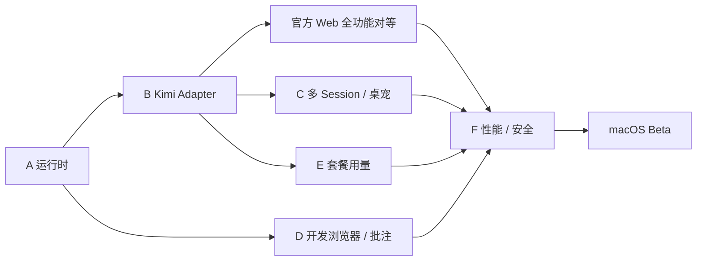

# 技术验证与交付路线

## 1. 为什么先做 Spike

这个产品最大的风险不在普通聊天 UI，而在五个边界：托管 Kimi 运行时、上游契约漂移、多 Session 状态与桌宠、Chromium 开发浏览器、套餐接口。先做可丢弃验证，可以在完整 UI 投入前得到明确的 go/no-go 证据。

公开 Beta 的门槛仍然是 Kimi Web P0 功能 100% 对等；中间里程碑允许不完整，但不能把不完整版本称为可替代官方 Web 的客户端。

当前逐项状态与测试证据维护在 [Kimi Web P0 实现审计](./07-p0-implementation-audit.md)。Session Controls、Goal、Background Tasks、Prompt Queue、Workspace/Session 完整生命周期，以及 Attachment/Media/Markdown 主链路已完成。下一顺序为 Conversation TOC、Compact、Undo、Cron notice 与本地图片源重写。

## 2. Spike A：托管 Kimi 运行时

> 实施记录：[0001-managed-runtime.md](./spikes/0001-managed-runtime.md)。当前已通过单次真实启动/健康检查/元数据/关闭链路，尚未完成 100 次循环与打包验证。

### 要回答的问题

- Electron 包内的 Node sidecar 能否稳定运行固定版本 Kimi Code？
- 能否在不执行全局 npm install、不改变 PATH 的前提下共享用户现有 Kimi 数据？
- 如何可靠取得随机端口、bearer token、server ID 和 ready 状态？
- App 退出、崩溃、升级时 Kimi 子进程如何回收或接管？

### 最小实现

- 打包 `@moonshot-ai/kimi-code@0.29.0` 和兼容 Node。
- 启动 `kimi web --port 0 --no-open`。
- 调用 `/health`、`/meta`、`/auth`，随后正常 shutdown。
- 检测系统 `kimi` `0.28.0`，展示不兼容并允许用户显式切换。

### 通过标准

- 连续启动/停止 100 次无残留进程和端口。
- 不修改用户 PATH、全局 npm、Kimi config/credentials。
- bearer token 不出现在 Renderer、普通日志或崩溃报告。
- 托管版和系统版切换后，双方看到同一批官方 Kimi Session。
- App 强退后下次启动能发现和安全处理残留实例。

### 失败后的选择

若 bundling Node/Kimi 受签名或体积阻塞，退为“首次引导安装官方 Kimi + 系统路径模式”，但仍不允许 `stream-json` 主接入。

## 3. Spike B：Kimi API 契约与全功能骨架

> 实施记录：[0002-kimi-contract.md](./spikes/0002-kimi-contract.md)。当前已建立 0.29.0 契约快照、核心 route/message 门禁、snapshot/Transcript/Prompt/Approval/Question 和 WS resync 垂直切片；完整官方 projector 事件面仍待补齐。

### 要回答的问题

- 官方 Web adapter 能否抽成环境无关的 Bridge？
- Snapshot/cursor/resync 能否在 Utility Process 中工作？
- 0.29.x 的 OpenAPI/AsyncAPI 是否足以做版本门禁？

### 最小实现

- 同步官方 `client.ts`、`ws.ts`、wire、mapper、projector、reducer 所需最小集合。
- 展示 Workspace/Session 列表、一个流式 Turn、Tool、Approval 和 Question。
- 做一次 WS 人为断线、gap 和 snapshot resync。
- 生成 `upstream.json` 和 MIT NOTICE。

### 通过标准

- 官方 Kimi Web fixture 在 adapter 测试中通过。
- REST envelope `code != 0` 不被误判为成功。
- 流式 Turn 断线恢复不重复 token、不丢工具状态。
- Unknown event 被记录但不造成 reducer 崩溃。
- 0.29.x 缺少任一核心 route/schema 时契约测试明确失败。

## 4. Spike C：多 Session 状态和桌宠

### 要回答的问题

- 一个 WS 连接能否稳定追踪多个同时运行的 Session？
- `busy/main_turn_active/pending_interaction/last_turn_reason` 是否足够驱动桌宠？
- 关闭主窗口后 Bridge/Pet 是否继续工作？

### 最小实现

- 同时启动三个 Session：普通运行、等待 Approval、后台 Task。
- 创建透明占位宠物窗口，不投入正式美术和附加玩法。
- 状态变更、完成、失败、断线映射到不同颜色/文字；动画不是通过门槛。
- 点击窗口必须能打开/恢复 App，返回绑定的准确 Session 和交互卡。

### 通过标准

- 状态事件到宠物 p95 < 500 ms。
- 100 次随机 Session 切换/完成没有错绑。
- 主窗口关闭后宠物继续更新；重新打开不新建 Session。
- App 重启从 Kimi Server 恢复真实活跃集合，无幽灵宠物。
- Waiting 优先于 Running；Approval/Question 不允许在宠物窗口直接批准。

本 Spike 的核心结论只看状态链路和 Session 跳转是否可靠。角色精修、完整动作、边缘吸附、个性化设置和宠物包均不进入 P0 阻塞项。

## 5. Spike D：开发浏览器与 HTML 批注

### 要回答的问题

- `WebContentsView` 能否与 Vue 右侧布局、resize 和多 tab 稳定配合？
- CDP Console/Network 能否在发布构建中可靠工作？
- 隔离 world 批注层能否覆盖 SPA 导航、滚动和缩放？
- 截图和结构化批注能否通过官方 Kimi attachment/prompt 流程发送？

### 最小实现

- 打开 Workspace 静态 HTML 和一个 localhost Vite 页面。
- 显示 Console 和 Network 摘要，验证 Header 去敏和内存预算。
- 选择一个 DOM 元素、框选一个区域、写两条反馈、生成截图。
- 向真实 Kimi Session 发送截图 + 批注 Markdown，并在 Transcript 中验证。

### 通过标准

- HTML 点击到可见页面 < 1.5 s（本地已启动服务）。
- 页面无法调用 Node 或任意主进程 IPC。
- Navigation、弹窗、下载、权限请求均经过策略处理。
- 批注位置在滚动、DPR=2、页面缩放后仍准确。
- 跨域 iframe 明确降级为外框区域批注。
- Prompt 中不含 Cookie、Authorization、完整 Network body。

### 可接受降级

DOM 锚点如果不够稳定，首版仍可提供“截图区域 + 编号 + 用户文字”的画面反馈。开发浏览器是 P0；DOM 精确批注不是发布硬阻塞。

## 6. Spike E：套餐用量

### 要回答的问题

- `/api/v1/oauth/usage` 在真实 Kimi Coding OAuth 账号上的字段和错误行为是否稳定？
- 不同套餐是否可能只有 summary、只有 limits 或没有 Extra Usage？
- reset hint 是否足够显示，还是还要保留原始 `resetAt`？

### 最小实现

- 调用真实托管 Provider 的 usage route。
- 覆盖 success、未登录、401、404、429、timeout 和空数据 fixture。
- 实现 30s/60s single-flight 轮询和阈值去重。

### 通过标准

- UI 能分别展示 summary、limits、Extra Usage 和最后更新时间。
- 空字段不会导致 NaN、负进度或崩溃。
- 失败保留最后成功值，不误显示为 0%。
- App 后台运行 8 小时无请求堆积或重复通知。
- 所有请求只通过本地 Kimi Server，不读取 OAuth 文件。

## 7. Spike F：长会话、大 Diff 和安全基线

### 数据集

- 1000 Turn，包含 100 个代码块、20 个 Mermaid、20 个大 Tool result。
- 每秒高频 token/event burst。
- 1000 个 Changed Files。
- 200 MB 二进制、20 MB 文本文件、超长单行文件。
- 恶意 Markdown、恶意 HTML、导航/下载/popup、path traversal 和 symlink escape。

### 通过标准

- 历史 Turn 不随 streaming 全量重新渲染。
- 可见 DOM 数量受 viewport 控制。
- 二进制不进入文本 Diff；大 Diff 有明确截断和继续操作。
- 进程内存不随二进制文件大小按多份字符串放大。
- Renderer 无 Node，IPC schema fuzz 不越权。
- token/credentials/Cookie 不进入日志和诊断包。

## 8. 交付依赖顺序

建议里程碑：

1. **Foundation：** Runtime Manager、Bridge、typed IPC、窗口骨架。
2. **Vertical Slice：** 一个真实 Session 从 Prompt 到 Tool/Approval/完成。
3. **Parity Complete：** 功能对照表 P0 全部映射。
4. **Desktop Differentiators：** Browser、Usage、Pet；批注至少达到截图区域版本。
5. **Hardening：** 长会话、大 Diff、断线、恶意内容、签名和升级。
6. **Beta：** 只在所有 P0 门禁通过后发布。

## 9. 首批实现切片

Spike 通过后，正式代码按以下顺序落地：

1. App shell + managed runtime + Bridge。
2. Workspace/Session 左栏和 snapshot 恢复。
3. Turn 对话、Composer、Prompt/Steer/Abort。
4. Approval/Question/Tool/Thinking。
5. Files/Changes/Diff/Terminal。
6. Model/Provider/OAuth/Settings/Skills/MCP/Agents。
7. Browser 和 HTML 路由。
8. Usage。
9. Pet。
10. Annotation、美术和整体动效。

这一顺序只描述依赖，不表示第 3 步就能对外发布。

当前进度：第 1–10 步已有可运行垂直切片。Model/Provider/OAuth/Settings、Skills、Tools/MCP 与 Agent roster 的边界分别记录在 [ADR 0005](./adr/0005-kimi-v2-provider-mutation-boundary.md) 和 [ADR 0006](./adr/0006-kimi-skills-mcp-agent-projection.md)。Browser 已接入 Main 管理的 WebContentsView、Main header capability、受限 Workspace Preview、HTML 路由、localhost discovery、视口、Console/Network、截图，以及隔离 World 的元素/区域批注和普通 Prompt 图片提交，安全边界记录在 [ADR 0007](./adr/0007-browser-webcontentsview-preview-boundary.md) 与 [ADR 0010](./adr/0010-browser-annotation-isolated-world-and-prompt-boundary.md)。Usage 已接入官方 `/oauth/usage`、30/60 秒 single-flight 轮询、失败保留/退避、Extra Usage、Session token 与 Context 分区 UI，边界记录在 [ADR 0008](./adr/0008-usage-authority-polling-boundary.md)。Pet 已完成独立多 Session 状态聚合、透明受限窗口、拖拽吸边、状态优先级、轻量动画和点击回 Session 的产物级验证，边界记录在 [ADR 0009](./adr/0009-pet-multi-session-window-boundary.md)。下一阶段审计 `/tasks`、BTW、Goal/Todo 等其余 P0，不由 roster 或本地占位状态推断。

## 10. Go / No-Go 条件

### Go

- 托管 Kimi 可以无侵入运行并通过契约测试。
- 官方 Web 的事件投影能够复用或稳定移植。
- 多 Session 状态足够可靠地驱动宠物。
- Electron Browser 能满足开发预览和安全边界。
- Usage route 在真实账号上可用。

### 需要调整

- HTML DOM 锚点不稳定：降级到区域截图批注。
- 宠物群过度打扰：默认只显示 Waiting/Running 或合并成单宠物入口。
- Electron 内存偏高：继续使用 Electron，但限制 Browser tab、背景冻结和事件缓冲；不要因此牺牲开发浏览器功能。

### No-Go 或必须重新设计

- 官方 Server API 被移除或无法合法分发/调用。
- 托管运行时必须覆写用户 Kimi 配置才能工作。
- 核心事件无法通过 snapshot/resync 保证一致性。
- Browser guest 无法与主应用形成可靠安全隔离。

## 11. 开工前最后检查

- [x] 确认产品名、bundle ID 和仓库 license（Moon Code；项目采用 MIT）。
- [x] 确认 Kimi MIT LICENSE/NOTICE 分发方式。
- [ ] 确认首个支持区间和 runtime 更新签名方案。
- [ ] 将功能对照表转成 issue/测试用例，而不是只留在文档。
- [x] 为桌宠设计原创素材 brief，不复制 Codex built-in pet（Mimo：月白云猫，见 `design/pets/mimo-run/pet_request.json`）。
- [ ] 为 Electron IPC、Browser、Preview Server 做 threat model。
- [ ] 只有在 Spike 结果被记录后，才冻结首版技术架构。
