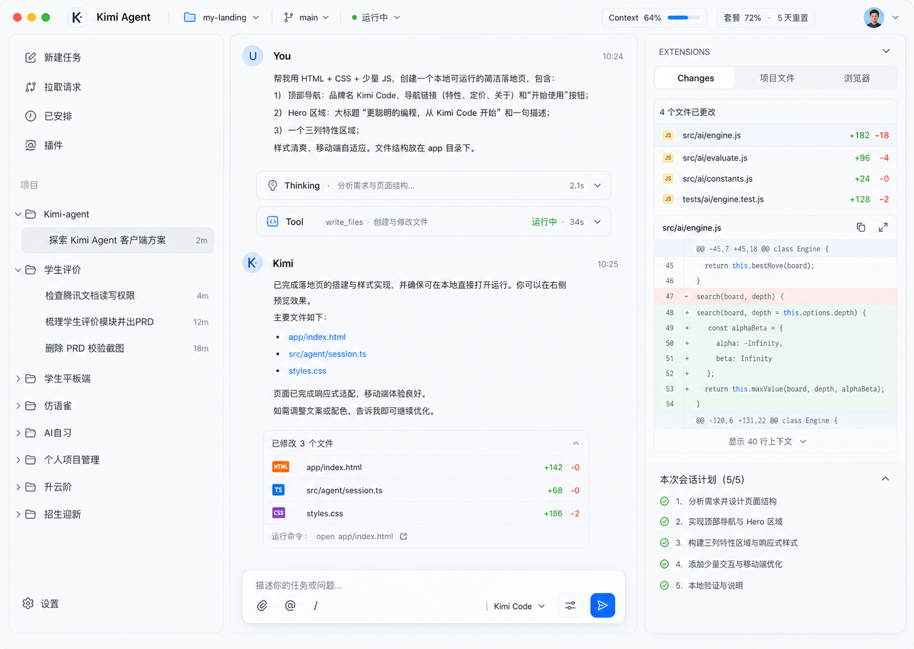

# Moon Code 视觉基线

> 版本：v0.1（已确认）
> 确认日期：2026-07-23
> 状态：主工作台的排版、层级与视觉风格已纳入基线；后续只做尺寸、字重、图标、间距和交互细节微调。

本基线用于约束后续原型、正式 UI 和其他页面的视觉延展。它不是像素级终稿，也不替代可访问性、状态设计和技术实现规格。

## 1. 已确认方向

- 采用清新浅色桌面工具风格，使用克制的毛玻璃/轻液态玻璃，不做大面积高光和营销感渐变。
- 排版吸收 Codex 的留白与层级，以及 ZCode 的三栏工作效率，但不复制两者素材、品牌或协议。
- 顶部为贯穿窗口的全局导航；其下固定为左侧项目任务树、中间会话、右侧扩展区三栏。
- 左栏按项目组织任务，不按 Running、Waiting、Completed 等状态分组。
- 中栏保持连续的 Turn 会话阅读体验；底部 Composer 紧凑，次要配置按需展开。
- 右栏只保留 Changes、项目文件、浏览器三个一级标签；Changes 下半部分承载本次会话计划。
- 右栏可折叠、可调宽；折叠后中栏获得空间，不销毁当前标签状态。
- Kimi Workspace、Session、Transcript 仍是唯一事实源。视觉上的“项目”映射 Workspace，“任务”映射 Session。

## 2. 主工作台参考



这张图只确定视觉语言、信息层级和默认布局。图中的具体文案、数据、图标、像素尺寸及组件状态不是最终实现约束。

## 3. 总体布局

```text
┌────────────────────────────── 全局顶部导航 ──────────────────────────────┐
├──────────────┬────────────────────────────────┬─────────────────────────┤
│ 项目 / 任务   │ Turn 会话                     │ Changes / 项目文件 / 浏览器 │
│              │                                │                         │
│              │ Terminal 抽屉（按需展开）       │ Changes 下半：会话计划    │
│              │                                │                         │
│              │ 紧凑 Composer                  │ 可折叠、可调宽             │
└──────────────┴────────────────────────────────┴─────────────────────────┘
```

默认尺寸先作为实现种子，而不是不可调整的常量：

| 区域 | 默认建议 | 行为 |
| --- | ---: | --- |
| 顶部导航 | 52–56 px 高 | 始终贯穿整个窗口 |
| 左栏 | 260–288 px | 可在窄窗口折叠 |
| 中栏 | `minmax(560px, 1fr)` | 始终是视觉主区域 |
| 右栏 | 360–400 px | 可拖动调宽并整体折叠 |

三栏主要依靠对齐、留白、底色差和 1 px 分隔线建立层级。避免将每一行、每一段消息或每个工具事件都做成独立卡片。

## 4. 顶部导航

顶部导航只承载全局上下文：

- 应用标识 `Moon Code`。
- 当前项目/Workspace、Git branch（可用时）。
- 当前 Session 运行状态。
- Context 使用量。
- Kimi 套餐用量与重置时间。
- 搜索、窗口布局或账户等低频入口。

顶部导航使用轻微半透明与模糊即可，不能比会话内容更抢眼。套餐与 Context 是轻量状态，不做成仪表盘卡片。

## 5. 左栏：快捷操作与项目任务树

### 5.1 快捷操作

左上使用普通导航行，不使用高饱和主按钮。首版显示：

- 新建任务
- 拉取请求
- 已安排
- 插件

每项由小号线性图标和文字组成，默认无填充背景；Hover 只增加轻底色。全局搜索优先通过顶部图标与 `⌘K` 进入，不在左上堆放大型搜索框和筛选器。

### 5.2 项目树

- 使用弱化标题“项目”。
- 项目行对应 Kimi Workspace，以文件夹图标、名称和展开箭头表示。
- 项目下缩进显示任务；任务对应 Kimi Session。
- 任务不按状态分区。状态点、未读、相对时间或需处理标记只能作为行尾的次级信息。
- 当前任务使用中性浅灰或极淡蓝的圆角底色；避免整行高饱和蓝色。
- 折叠项目时保留内部任务的未读/需处理汇总，但不改变 Kimi Session 数据。
- 大量项目和任务使用虚拟列表；切换任务时保留草稿、滚动锚点和右栏上下文。

## 6. 中栏：Turn 会话与 Composer

### 6.1 会话正文

- 对话以连续 Transcript 呈现，不使用左右气泡。
- 用户 Prompt、Assistant 文本、Thinking、Tool Group、Approval/Question 和 Turn 结果属于同一个 Turn 的结构。
- Thinking 与工具明细默认以紧凑行折叠，流式执行时显示低干扰活动状态。
- 文件路径使用蓝色可点击文本；普通文件进入项目文件预览，HTML 优先进入内置浏览器。
- Changed Files 使用一个轻量分组摘要，不与右栏完整 Diff 重复竞争。
- 用户离开底部时显示“回到最新”和未读计数，不强制滚动。

### 6.2 紧凑 Composer

Composer 固定在中栏底部，但不完整铺开所有配置：

- 主体是一块低高度、可自然增长的多行输入区。
- 一级操作仅保留附件、`@` 文件引用、Slash Command 和发送。
- 可显示一个很轻的当前模型摘要，例如 `Kimi Code`。
- Model、Thinking、Permission、Plan、Swarm 收入一个设置/调节入口，点击后用 Popover 展开；从输入到修改任一选项不超过一次点击。
- 非默认或高风险状态不能完全藏起：例如 Yolo、Plan 关闭、排队 Prompt 等，必须在 Composer 表面显示持续可见的简短 Chip。
- Session 正在运行时，再次发送要明确提供 Queue 或 Steer 选择。

## 7. 右栏：扩展工作区

右栏包含三个一级标签：

1. **Changes：** 上半部分显示 Changed Files、Git 状态和 Diff；下半部分固定为“本次会话计划”。
2. **项目文件：** 文件树、搜索、文件预览和定位行。
3. **浏览器：** Preview、Console、Network 和 HTML 批注。

右栏交互约束：

- 标题区始终有清晰但低调的折叠按钮。
- 左侧分隔线支持拖动调宽；宽度在会话内保持。
- 折叠只改变布局，不卸载 Browser 页面、不清空 Diff 选择、不重置计划展开状态。
- Terminal 不占一级标签，固定为中栏 Conversation 下方、Composer 上方的按需抽屉，通过 `⌘J` 或 Composer 入口展开；Agents、Goal 等其他完整功能通过命令、快捷键或上下文入口进入。

## 8. 视觉语言

### 色彩种子

以下颜色用于原型起步，正式 Token 可在对比度测试后微调：

| 用途 | 建议值 |
| --- | --- |
| 窗口底色 | `#F7FAFC` |
| 主内容面 | `rgba(255, 255, 255, 0.82)` |
| 毛玻璃侧栏 | `rgba(255, 255, 255, 0.62)` |
| 分隔线 | `rgba(96, 116, 138, 0.16)` |
| 主文字 | `#20252D` |
| 次文字 | `#687386` |
| 链接/激活 | `#2563EB` |
| 成功 | `#16A36A` |
| 需处理/删除 | `#E25555` |

蓝色主要用于文件链接、当前选择、发送和少量交互反馈；绿色、橙色、红色只表达真实状态。颜色不能是唯一状态信号。

### 材质与层级

- 毛玻璃集中在顶部导航、左右侧栏和 Composer；会话正文尽量平整、安静。
- 背景允许极淡的天空蓝/水绿色环境光，但不能形成明显的大面积渐变主视觉。
- 分隔优先级：留白与对齐 > 细分隔线 > 微弱底色 > 边框 > 阴影。
- 阴影仅用于浮层、Popover 和需要脱离底面的 Composer，且保持低扩散、低对比度。
- 圆角以 10–14 px 为主；列表 Hover 和选中行可使用 8–12 px。

### 字体与密度

- 中文与 UI 正文以 14–16 px 为基线，行高约 1.45–1.6。
- 命令、路径和 Diff 使用等宽字体；其余区域使用系统无衬线字体。
- 使用 4 px 基础网格，主要间距采用 8 / 12 / 16 / 24 px。
- 保持桌面工具的信息密度，但不以缩小字号来换空间。

## 9. 动效与可访问性

- Hover、选中、右栏折叠和 Popover 使用 120–180 ms 的克制过渡。
- Running 使用低频、低幅度活动反馈；Waiting、Failed 和需处理状态优先使用文案与图标。
- 遵守 macOS Reduce Motion；关闭动效时仍能从图标、文字和结构识别状态。
- 正文、次文字、链接、Diff 和状态颜色在毛玻璃背景上仍需满足目标对比度。
- 三栏分隔、折叠按钮、标签页、任务树和 Composer 必须支持键盘与清晰焦点态。

## 10. 延展到其他页面

后续页面继续沿用本基线的色彩、字体、分隔、圆角和玻璃范围：

- 浏览器与 HTML 批注工作区。
- 套餐用量弹层及用量设置页。
- 桌宠管理与 Session 跳转设置。
- 插件、Skill、MCP 和应用设置。
- 拉取请求与已安排任务。

其他页面可以改变内容布局，但不得重新引入营销式大卡片、全屏渐变或过度玻璃高光。

桌宠是这条规则的轻量例外：首版只需保持干净、可辨识、不遮挡工作，并清楚显示 Session 状态。其视觉精细度和动画丰富度不属于主工作台视觉基线的验收范围；点击后打开 App 并准确进入绑定 Session 才是核心体验。

## 11. 基线内的后续微调

- 左、中、右栏最终默认宽度与最小宽度。
- 左栏快捷操作和项目树的最终图标集。
- 选中行是中性灰还是极淡蓝，以及 Hover/Focus 的差异。
- Composer 展开高度、模型摘要与高风险状态 Chip 的具体位置。
- 右栏折叠后的窄条形态、拖动热区与恢复入口。
- 中文/英文混排的最终字体和字重。
- 毛玻璃透明度、环境光强度和 Reduce Transparency 降级方案。
- 空状态、错误、断线、Approval/Question、Queued/Steer 等关键状态稿。

上述项目属于基线内微调，不需要重新确认整体方向，但应通过实际界面截图做视觉回归。若改动三栏信息架构、项目式任务组织、紧凑 Composer、右栏一级标签或整体视觉语言，则视为基线变更，需要更新版本并记录原因。
